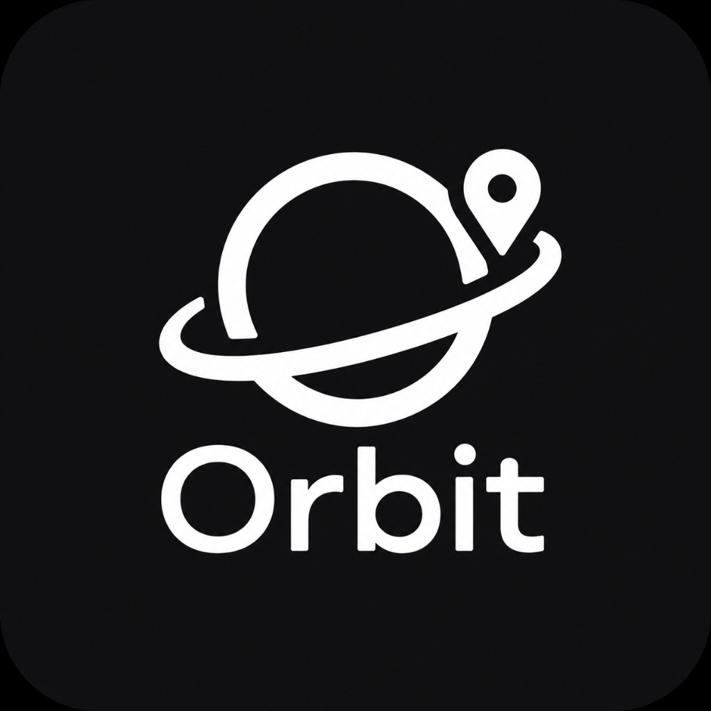

# Orbit (CSEN 174)

Orbit is an audio-first travel companion that recommends nearby points of interest, speaks a short AI-guided narration, and lets travelers ask follow-up questions by voice.



## Demo and report

- **Live/TestFlight URL:** <https://testflight.apple.com/join/4t68t4bB>
- **Demo video:** **NEEDS TEAM LINK** - paste the final demo video URL here.
- **Technical report:** [TECHNICAL_REPORT.md](TECHNICAL_REPORT.md)
- **Summary card:** [summary-card.pdf](summary-card.pdf)
- **Screenshot/GIF:** **NEEDS TEAM FILE** - add a current product screenshot or short GIF and embed it here.

## Team

- Kieran Greeley
- GP Hora
- Rosalie Wessels
- Daniel Louie
- Iker Mendiburu

## Repository map

- [`app/`](app/) - consolidated Flutter mobile app.
- [`geo-poi-database/`](geo-poi-database/) - Node tooling for POI generation, Firebase seeding, and geo POI tests.
- [`tests/`](tests/) - shared Dart and Node-facing test deliverables.
- [`docs/`](docs/) - sprint testing, CI/CD, retrospectives, ethics, and architecture reflection.
- [`architecture/`](architecture/) - target architecture and C4 diagrams.
- [`LLM-Integration/`](LLM-Integration/), [`location-engine/`](location-engine/), [`voice-interface/`](voice-interface/) - supporting packages and seams from the quarter.

## How to run

1. Install Flutter and Dart, then clone the repo.
2. Copy `app/.env.example` to `app/.env` and fill in Firebase, Groq, and OpenRouter values from the team.
3. Generate native Firebase config from `app/`:

   ```bash
   bash scripts/write_firebase_native_config.sh
   ```

4. Run the app from `app/`:

   ```bash
   flutter pub get
   flutter run --dart-define-from-file=.env
   ```

5. Run shared tests:

   ```bash
   cd tests && dart pub get && dart test .
   cd ../geo-poi-database && npm install && npm test
   ```

