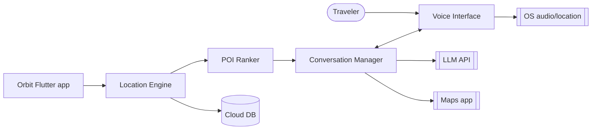
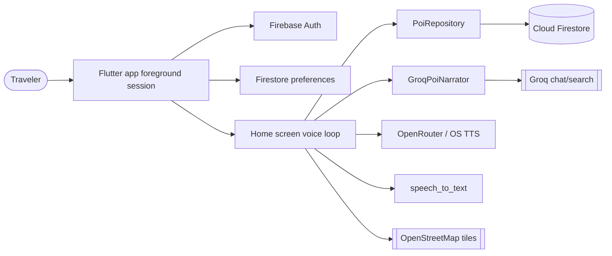
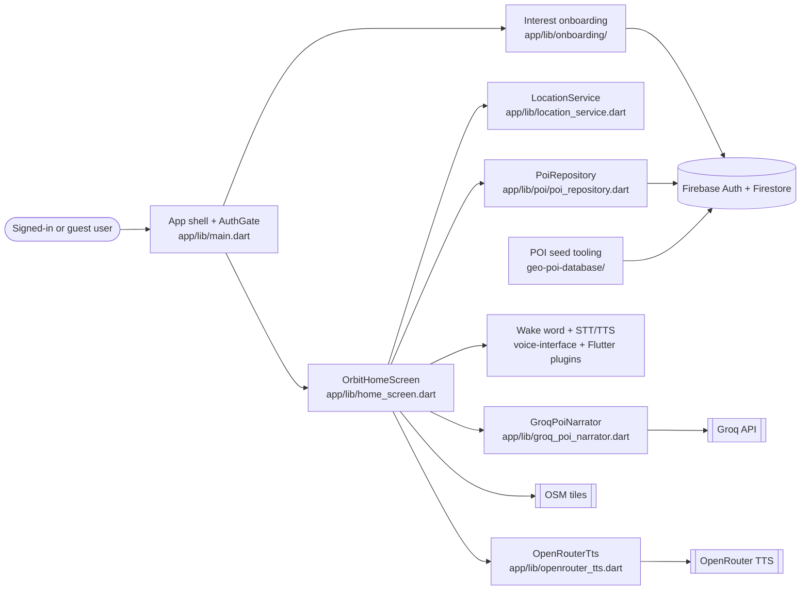

# Orbit Final Technical Report

Orbit · Kieran Greeley, GP Hora, Rosalie Wessels, Daniel Louie, Iker Mendiburu · Spring 2026

> Export note: this Markdown file is the source for the graded PDF. Before submitting, export it to PDF with 11 pt body text and 1 inch margins. Items marked **NEEDS TEAM LINK/FILE** are intentionally visible placeholders for artifacts that were not present in the repository at drafting time.

## 1. Product vision and evolution

In W2, Orbit was framed as an AI-powered interactive travel guide for travelers who wanted meaningful points of interest without constant planning. The original vision emphasized location-aware recommendations, natural language generation, and conversational voice as an alternative to static map apps and pre-planned tours ([`product-vision.md`](product-vision.md)).

The current prototype still serves travelers exploring on foot, but the product narrowed from "smart map companion" to "screen-free audio guide." The app now prioritizes a foreground loop: sign in, choose interests, get a nearby place, hear an AI narration, and ask follow-up questions by voice. Three decisions bent the vision:

1. **Map-first discovery became audio-first guidance.** The early "map pin plus taste profile" idea was useful, but sprint feedback pushed the team toward earbuds and voice as the differentiator.
2. **Fully proactive pings were deferred.** Background geofencing and fatigue controls stayed in the target architecture, while Sprint 2 shipped a foreground voice session first.
3. **Natural onboarding became interest chips for v1.** Conversational onboarding remained a goal, but tap-to-select interests gave the team a shippable path through Firebase and Firestore.

The W2/W3 persona/storyboard artifact is not currently committed as a standalone file. **NEEDS TEAM FILE:** add or link the W2 persona/storyboard artifact, preferably under `docs/`, then cite it here. The product still serves that likely persona: a traveler who wants less planning and fewer choices, but now by listening and talking rather than scrolling.

**Section references:** [`product-vision.md`](product-vision.md), [`docs/architecture-retrospective.md`](docs/architecture-retrospective.md), **NEEDS TEAM FILE:** W2/W3 storyboard or persona artifact.

## 2. Architecture evolution

### W4 initial architecture

W4 described Orbit as a background, location-triggered voice loop. The planned app would detect location, query curated POIs, rank candidates, speak a proactive ping, handle speech follow-ups through an LLM, and open maps for directions ([`architecture/architecture.md`](architecture/architecture.md)).

### W8 revised architecture

By W8/Sprint 2, the team had a foreground app rather than the full proactive loop. The revised architecture kept Firebase and LLM integration, but the live voice path moved into the Flutter app's home screen. Repo packages for the location engine, voice interface, and LLM integration existed, but several were not yet wired into the primary experience.

### Current architecture at code freeze

The current code freeze is still a consolidated Flutter app in `app/`, with supporting packages and admin tooling around it. Recent commits added the Orbit branding, wake-word interaction, OpenRouter TTS, settings/preferences, and crash fixes. The seams are now clear: `AuthGate` routes users through sign-in and onboarding, `OrbitHomeScreen` coordinates location/POI/voice/chat, `PoiRepository` reads Firestore by geohash and tags, and `GroqPoiNarrator` produces grounded narration and follow-up answers.

Architectural decisions with repo evidence:

- **Background pings to foreground voice session.** The trigger was Sprint 2 velocity and iOS background-location risk. Evidence: W4 target in [`architecture/architecture.md`](architecture/architecture.md), shipped foreground flow in [`app/lib/home_screen.dart`](app/lib/home_screen.dart), and the tradeoff recorded in [`docs/architecture-retrospective.md`](docs/architecture-retrospective.md).
- **Separate Conversation Manager to in-app `GroqPoiNarrator`.** The trigger was needing grounded follow-ups and a demoable voice path. Evidence: [`app/lib/groq_poi_narrator.dart`](app/lib/groq_poi_narrator.dart), package tests in [`tests/gp_llm_guardrails_test.dart`](tests/gp_llm_guardrails_test.dart), and the duplicate-stack debt in [`docs/architecture-retrospective.md`](docs/architecture-retrospective.md).
- **Curated Firestore POIs over live places APIs.** The trigger was recommendation quality and lower API complexity. Evidence: [`geo-poi-database/seed_pois.js`](geo-poi-database/seed_pois.js), [`geo-poi-database/generate_pois_from_osm.js`](geo-poi-database/generate_pois_from_osm.js), [`app/lib/poi/poi_repository.dart`](app/lib/poi/poi_repository.dart), and [`firestore.rules`](firestore.rules).
- **Client-side secrets accepted for prototype, not production.** The trigger was course prototype speed. Evidence: [`app/.env.example`](app/.env.example) warns that keys in builds are extractable, while [`docs/architecture-retrospective.md`](docs/architecture-retrospective.md) names a backend-for-frontend proxy as the production fix.

**Section references:** [`architecture/architecture.md`](architecture/architecture.md), [`docs/architecture-retrospective.md`](docs/architecture-retrospective.md), [`app/lib/main.dart`](app/lib/main.dart), [`app/lib/home_screen.dart`](app/lib/home_screen.dart), [`app/lib/poi/poi_repository.dart`](app/lib/poi/poi_repository.dart), [`app/lib/groq_poi_narrator.dart`](app/lib/groq_poi_narrator.dart).

## 3. Current state of the prototype

Today Orbit is an installable Flutter prototype distributed through TestFlight: <https://testflight.apple.com/join/4t68t4bB>. A user signs in with Google, selects interests, lands on a voice-first home screen, gets a location-based POI recommendation from Firestore, hears an AI-generated narration, and can ask follow-up questions by voice or keyboard.

Major feature entry points:

- App boot, Firebase initialization, auth routing: [`app/lib/main.dart`](app/lib/main.dart).
- Google sign-in and user profile creation: [`app/lib/auth/auth_service.dart`](app/lib/auth/auth_service.dart).
- Interest onboarding and saved preferences: [`app/lib/onboarding/preferences_onboarding_screen.dart`](app/lib/onboarding/preferences_onboarding_screen.dart), [`app/lib/onboarding/firestore_preferences_service.dart`](app/lib/onboarding/firestore_preferences_service.dart).
- Voice, wake-word, map preview, chat UI, and main session orchestration: [`app/lib/home_screen.dart`](app/lib/home_screen.dart).
- Nearby POI query and ranking: [`app/lib/poi/poi_repository.dart`](app/lib/poi/poi_repository.dart).
- LLM narration and follow-ups: [`app/lib/groq_poi_narrator.dart`](app/lib/groq_poi_narrator.dart).
- Cloud TTS: [`app/lib/openrouter_tts.dart`](app/lib/openrouter_tts.dart).
- POI admin seed pipeline: [`geo-poi-database/`](geo-poi-database/).

What it does not do yet: true background geofencing, proactive ping fatigue controls, maps deep links, inferred preference write-back after conversations, production-safe API key proxying, and broad automated app-level integration tests. The demo snapshot is tagged as [`final-demo`](https://github.com/CSEN-SCU/csen-174-s26-team-project-tripsync/tree/final-demo). **NEEDS TEAM LINK:** add the final demo video URL here and in the README.

**Section references:** live TestFlight URL in [`docs/sprint-1-cicd.md`](docs/sprint-1-cicd.md), current code-freeze commit `20a9049`, demo snapshot tag [`final-demo`](https://github.com/CSEN-SCU/csen-174-s26-team-project-tripsync/tree/final-demo), **NEEDS TEAM LINK:** demo video.

## 4. Engineering process: testing, security, deployment

### Testing

Planned strategy in W5: each teammate wrote failing tests at a public seam, then moved the smallest implementation green using a red-green-refactor loop. The plan deliberately covered separate risk areas: preferences, location/DB, LLM behavior, transcript normalization, and Firestore geohash querying ([`docs/sprint-1-testing.md`](docs/sprint-1-testing.md)).

Implemented strategy: the repo now has Dart package tests and Node tests. A representative methodical test is Iker's location/DB contract test in [`tests/iker_location_database_unit_test.dart`](tests/iker_location_database_unit_test.dart). It asserts user-visible behavior and system constraints: no DB query without location consent, bounded-radius POI lookup, graceful failure on DB errors, and current-position reads. AI helped draft tests and critique them, but human judgment corrected over-coupled assertions; the W5 testing doc records the before/after critique of a spy-counter-style assertion.

### Security

Planned strategy in W7/W9: protect private user data, avoid committing secrets, and minimize location risk. Implemented fixes include Firestore rules that restrict `/users/{userId}` documents to their owner while keeping POI reads public and admin-only for writes ([`firestore.rules`](firestore.rules)). The app also documents that API keys in client builds are extractable and should move behind a backend proxy before production ([`app/.env.example`](app/.env.example)). Human judgment decided that one-shot location was safer for the prototype than persistent background tracking; AI helped surface the backend-for-frontend proxy debt in the architecture retrospective.

### Deployment

Planned strategy in W6: GitHub Actions for automatic CI on pushes and PRs, plus TestFlight for distribution. Implemented pipeline stages include checkout, Dart dependency install, Dart tests, Node setup, Node dependency install, Node tests, and optional Firebase native config generation from secrets ([`.github/workflows/ci.yml`](.github/workflows/ci.yml)). The Sprint 1 CI/CD write-up records the TestFlight URL and the initial CI setup commit `44c7b6685f294bf76a3bbff2da24e2d27451b66c` ([`docs/sprint-1-cicd.md`](docs/sprint-1-cicd.md)).

**Section references:** [`docs/sprint-1-testing.md`](docs/sprint-1-testing.md), [`tests/iker_location_database_unit_test.dart`](tests/iker_location_database_unit_test.dart), [`tests/gp_llm_guardrails_test.dart`](tests/gp_llm_guardrails_test.dart), [`firestore.rules`](firestore.rules), [`app/.env.example`](app/.env.example), [`.github/workflows/ci.yml`](.github/workflows/ci.yml), [`docs/sprint-1-cicd.md`](docs/sprint-1-cicd.md).

## 5. Successes, setbacks, and what would change

Successes:

1. **Everyone shipped a visible slice.** Sprint 1 produced a buildable app shell, TestFlight distribution, CI/CD, seeded Firebase POIs, and working development environments. That worked because the team split by subsystem early, then consolidated later ([`docs/sprint-1-retro.md`](docs/sprint-1-retro.md)).
2. **The team converged from prototypes to one Flutter app.** Sprint 2 connected auth, onboarding, location, POIs, voice, and LLM narration into a phone-runnable loop. The practice to keep is writing architecture retrospectives when the implementation diverges from the plan ([`docs/sprint-2-retro.md`](docs/sprint-2-retro.md), [`docs/architecture-retrospective.md`](docs/architecture-retrospective.md)).
3. **AI accelerated unfamiliar integration work.** Claude/Cursor helped with Flutter setup, CI, Groq prompts, Firestore queries, merge conflicts, and voice bugs. The useful pattern was asking with the repo open, then checking the output against actual files and tests.

Setbacks:

1. **Cards were too broad in Sprint 1.** The early signal was that "component" cards hid several smaller tasks, making progress hard to see. The team committed to breaking Kanban work into sub-issues in Sprint 2, but the card links were not committed. **NEEDS TEAM LINK:** Sprint board URL or screenshots for the broad Sprint 1 cards.
2. **Too much landed in `home_screen.dart`.** The team integrated quickly, but the home screen became the voice loop, map preview, POI selection, TTS/STT, and session state owner. The early signal was repeated merge pressure on one file. Next time, the team would extract Conversation Manager, Voice Interface, and POI selection earlier ([`app/lib/home_screen.dart`](app/lib/home_screen.dart), [`docs/architecture-retrospective.md`](docs/architecture-retrospective.md)).
3. **Jolli did not fit the repo workflow.** The team tried to connect it for process tracking, but the docs did not match the app structure, so syncing became overhead. Next time, the team would either commit screenshots/exported board artifacts or keep all planning evidence in GitHub issues and project boards ([`docs/sprint-1-testing.md`](docs/sprint-1-testing.md), [`docs/sprint-1-retro.md`](docs/sprint-1-retro.md)).

AI tools pulled their weight for setup-heavy and integration-heavy work: CI, Flutter/Firebase friction, Groq prompting, and debugging voice behavior. The team had to override or unwind AI output when it wrote tests too close to fake internals, when architecture prose drifted ahead of runtime reality, and when generated solutions assumed clean module boundaries that the sprint branch did not yet have.

**Section references:** [`docs/sprint-1-retro.md`](docs/sprint-1-retro.md), [`docs/sprint-2-retro.md`](docs/sprint-2-retro.md), [`docs/architecture-retrospective.md`](docs/architecture-retrospective.md), [`app/lib/home_screen.dart`](app/lib/home_screen.dart), **NEEDS TEAM LINK:** Sprint board URL/screenshots.

## 6. Future work

1. **Production-safe AI proxy (sprint-sized).** Move Groq and OpenRouter calls behind a backend-for-frontend so API keys are not extractable from the client. This matters before any public release beyond course/TestFlight users.
2. **Extract the live conversation stack (afternoon-sized to sprint-sized).** Pull voice session state, POI selection, and Groq conversation logic out of `home_screen.dart` into tested services. This reduces merge risk and aligns runtime code with the W4 component model.
3. **Background geofencing and fatigue controls (research plus sprint-sized implementation).** Add opt-in background location, quiet windows, cooldowns, and dismissal memory. This is core to the original proactive-companion vision but requires careful privacy and battery handling.
4. **Maps deep links and route handoff (afternoon-sized).** Add Apple/Google Maps URLs when a user asks for directions. This completes an edge in the original architecture without building navigation in-house.
5. **Field testing and data quality loop (sprint-sized).** Walk with the app, log bad recommendations, verify POI records, and add a lightweight admin review flow. This matters because a confident audio guide is only trustworthy if its place data is accurate.

**Section references:** [`docs/architecture-retrospective.md`](docs/architecture-retrospective.md), [`app/.env.example`](app/.env.example), [`app/lib/home_screen.dart`](app/lib/home_screen.dart), [`geo-poi-database/`](geo-poi-database/), [`architecture/architecture.md`](architecture/architecture.md).

## 7. Advice to future CSEN 174 teams

1. Keep every sprint artifact in the repo or link it from the repo the day you create it.
2. Do not let the demo path grow inside one giant screen just because it is faster that week.
3. Use AI to get unstuck, but make it prove its work through repo-specific tests, links, and diffs.

**Section references:** [`docs/sprint-1-testing.md`](docs/sprint-1-testing.md), [`docs/sprint-1-retro.md`](docs/sprint-1-retro.md), [`docs/sprint-2-retro.md`](docs/sprint-2-retro.md), [`docs/architecture-retrospective.md`](docs/architecture-retrospective.md).
