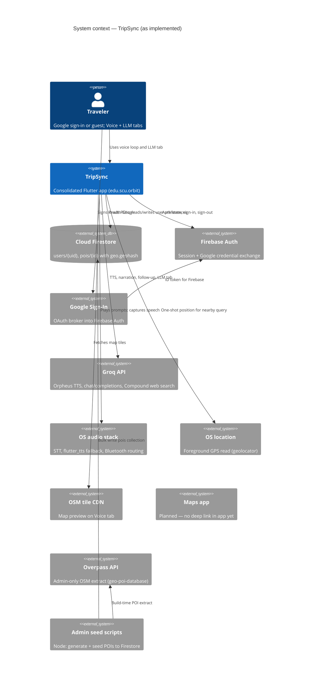
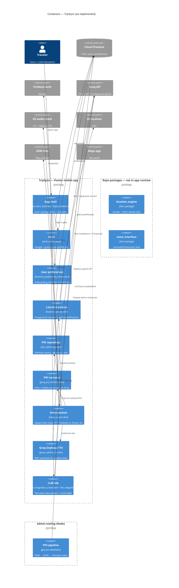

# TripSync — Architecture Retrospective

This document mirrors the structure of [`architecture.md`](architecture.md) but describes **what the repository actually runs today**, not the consolidated Orbit target. Use it for sprint reviews, onboarding, and gap analysis. The target design (Flutter containers, geofencing, maps deep links, preference-driven ranking) remains in `architecture.md`.

---

## What is TripSync today?

TripSync is the team’s **consolidated Flutter client** (`app/`) for an audio-first travel companion. A signed-in or guest traveler gets:

1. **Foreground location** via `geolocator` (single read on the Voice tab, not background geofencing).
2. **Nearby POI lookup** from **Cloud Firestore** (`pois` collection, geohash-bounded queries + interest scoring in `PoiRepository`).
3. **Spoken recommendations** via **Groq** (Orpheus TTS and/or `GroqPoiNarrator` chat with optional Compound web search), with **on-device STT** and **flutter_tts** fallback when Groq is unavailable.
4. **Voice follow-up** in a speak-then-listen loop on the home screen (`TripSyncHomeScreen`).
5. A separate **LLM tab** for text-in/text-out place descriptions and travel Q&A (`LlmIntegrationScreen` + `llm_integration` package).

Background auto-pings, maps deep links, geofencing, and writing inferred preferences back to Firestore are **not implemented** in the wired runtime yet.

---

## Repository layout (current)

| Path | Role |
|------|------|
| `app/` | Production Flutter app (TripSync / bundle `edu.scu.orbit`) |
| `LLM-Integration/` | Shared Groq chat client, guardrails, rate limiter — **wired** into `app/` |
| `geo-poi-database/` | Node admin tooling: OSM extract → JSON → Firestore seed |
| `location-engine/` | Tested haversine ranker + APIs — **not** in `app/pubspec.yaml` |
| `voice-interface/` | STT transcript normalizer stub — **not** in `app/pubspec.yaml` |
| `prototypes/` | Per-teammate divergent prototypes (historical; not the consolidated runtime) |
| `tests/` | Dart integration/unit tests across packages |
| `architecture/architecture.md` | Target Orbit architecture and consolidation plan |

---

## As-implemented tech stack

### Mobile app — Flutter (`app/`)

Single codebase for iOS and Android. Entry: `app/lib/main.dart` → `AuthGate` → onboarding or `TripSyncMainShell` (Voice + LLM tabs).

### Identity — Firebase Auth + Google Sign-In

`AuthService` signs in with Google (`google_sign_in`) or allows guest flow; first login writes `users/{uid}` in Firestore.

### Data — Cloud Firestore

- `users/{uid}` — profile + nested `preferences` (onboarding).
- `pois/{id}` — curated Bay Area POIs with `geo.geohash` / `geo.geopoint` and `tags`.
- Rules: users read/write own doc; `pois` are world-readable, client-writable only via admin seed scripts (`firestore.rules`).

### POI discovery — in-app `PoiRepository`

Geohash-bounded queries (`geofire_common.dart`) plus tag fallback, distance + interest scoring, and “nearest untagged” fallback. **Not** delegated to the `location_engine` package at runtime.

### Conversation AI — Groq (two call paths)

| Path | Package / file | Models / endpoints |
|------|----------------|-------------------|
| Voice tab narration + follow-ups | `app/lib/groq_poi_narrator.dart` | `groq/compound-mini` (web search), fallback `llama-3.3-70b-versatile` |
| LLM tab Q&A | `LLM-Integration` → `LlmClient` | `llama-3.3-70b-versatile` (configurable via `GROQ_LLM_MODEL`) |
| Spoken output | `app/lib/groq_orpheus_tts.dart` | `canopylabs/orpheus-v1-english` |

API keys load from gitignored `app/.env` or `--dart-define-from-file` (`tripsync_groq_config.dart`). This matches the target doc’s client-direct LLM risk; a BFF is still the scale-up path.

### Audio — OS + Groq

- **STT:** `speech_to_text` in `home_screen.dart` (platform `SpeechRecognizer`).
- **TTS:** Groq Orpheus WAV playback when `GROQ_API_KEY` is set; else `flutter_tts`.
- **Routing:** `headset_media_bridge.dart` / `audio_session` for headset-friendly playback.

### Location — `geolocator` only

`LocationService` requests permission and calls `getCurrentPosition` once per Voice-tab session. No geofence plugin, no background location loop.

### Map preview — OpenStreetMap tiles

`flutter_map` + `tile.openstreetmap.org` on the home screen (display only).

### Admin / curation — `geo-poi-database/`

`generate_pois_from_osm.js` (Overpass API) → `data/bay_area_pois.json` → `seed_pois.js` (`firebase-admin`). Never called from the mobile app.

---

## Gaps vs. target (`architecture.md`)

| Target container / capability | Current state |
|------------------------------|---------------|
| **Location Engine** with geofencing | Foreground `LocationService` only; `location_engine` package tested but unwired |
| **POI Ranker** as separate container | Logic inlined in `PoiRepository` + home screen interest tags |
| **Conversation Manager** with preference writes | `GroqPoiNarrator` + voice loop; **hardcoded** interest tags on home screen; no inferred-preference writes |
| **Voice Interface** package | STT/TTS live in `home_screen.dart`; `voice_interface` still `UnimplementedError` |
| **Maps app** deep link | No `url_launcher` / maps URIs in `app/` |
| **Background proactive pings** | Commented as later build; manual speak/listen session only |
| Product name “Orbit” in diagrams | Shipped app title **TripSync**; vision still aligned with `product-vision.md` |

---

## Key decisions (retrospective)

**Firestore + geohash over a custom backend.** The team shipped curated POIs and user prefs without a BFF; ranking runs on-device after a bounded Firestore read.

**Groq for both voice script and TTS.** Reduces moving parts for the prototype but concentrates secrets and rate limits in the client (`app/.env.example` documents production proxying).

**Monolith home screen for voice.** Faster iteration than extracting `voice_interface`, at the cost of blurrier container boundaries versus the target C4.

**Sibling packages for CI/TDD.** `llm_integration` is production-wired; `location_engine` and `voice_interface` support tests and future adapters without changing UI contracts yet.

**Ping fatigue controls deferred.** Cooldowns and hourly caps from the target doc are not enforced in code.

---

## Retrospective trade-offs

- **Client-direct Firebase + Groq** matched sprint velocity; abuse and key extraction remain open items before wide release.
- **Curated Firestore POIs** delivered editorial control; Bay Area seed data depends on the admin pipeline, not live Places APIs.
- **Dual LLM entry points** (`GroqPoiNarrator` vs `LlmClient`) share one API key but different prompts and models — consolidate behind a single conversation façade when preferences and session state land.
- **Onboarding preferences stored but not consumed** on the Voice tab (`_hardcodedInterestTags` in `home_screen.dart`) — wiring `FirestorePreferencesService` into `PoiRepository` is the highest-impact personalization fix.

---

## C4 diagrams

The **context** diagram shows external systems the shipped app talks to. The **container** diagram shows runnable pieces inside the Flutter boundary and what remains repo-only or admin-only.

### Context diagram

**Narrative.** The **traveler** uses **TripSync** (consolidated Flutter app). TripSync uses **Firebase Auth** (including **Google Sign-In**) for identity, **Cloud Firestore** for POIs and user preferences, and **Groq** for TTS and chat. **OS audio** and **OS location** handle mic, playback, and GPS. **OSM tiles** feed the map preview. **Maps app** appears as a planned external handoff (not wired). **Admin tooling** (`geo-poi-database`) seeds Firestore offline via **Overpass** and is outside the mobile runtime.

### Container diagram

**Narrative.** Inside **TripSync — Flutter mobile app**, the **App shell** routes auth and onboarding. **Auth** and **User preferences** talk to **Firebase Auth** and **Firestore**. On the Voice tab, **Location service** reads GPS, **POI repository** queries and ranks Firestore POIs, **POI narrator** calls **Groq** for scripts and follow-ups, and **Voice session** orchestrates STT/TTS (Groq Orpheus or OS fallback). The **LLM tab** uses the **`llm_integration`** package against the same **Groq** API. Repo packages **location_engine** and **voice_interface** and runtime **maps deep link** are shown as planned/not wired. **Admin tooling** runs off-device.

---

## External dependencies (call sites)

| Dependency | Kind | Wired in `app/`? | Primary call site |
|------------|------|------------------|-------------------|
| Firebase Auth | Identity | Yes | `app/lib/main.dart`, `app/lib/auth/auth_service.dart` |
| Cloud Firestore | Database | Yes | `auth_service.dart`, `firestore_preferences_service.dart`, `poi_repository.dart` |
| Google Sign-In | Identity broker | Yes | `auth_service.dart` |
| Groq Orpheus TTS | AI (speech) | Yes | `groq_orpheus_tts.dart` ← `home_screen.dart` |
| Groq chat / Compound | AI (text) | Yes | `groq_poi_narrator.dart`, `llm_integration` / `LlmClient` |
| `speech_to_text` / `flutter_tts` | OS speech | Yes | `home_screen.dart` |
| `geolocator` | OS GPS | Yes | `location_service.dart` |
| OSM tile CDN | Map tiles | Yes | `home_screen.dart` (`flutter_map`) |
| Overpass API | OSM extract | Admin only | `geo-poi-database/generate_pois_from_osm.js` |
| Apple / Google Maps | Navigation | No | — |

---

## One-sentence summary

TripSync today is a **Flutter client** that authenticates with **Firebase**, loads and ranks **Firestore POIs** from a **foreground GPS** read, speaks and listens on the **Voice tab** via **Groq + OS audio**, and exposes a separate **LLM tab** through **`llm_integration`** — while **geofencing**, **maps handoff**, **background pings**, **preference-driven voice ranking**, and the **`location_engine` / `voice_interface` packages** remain aligned with the target doc but not yet part of the live app loop.
