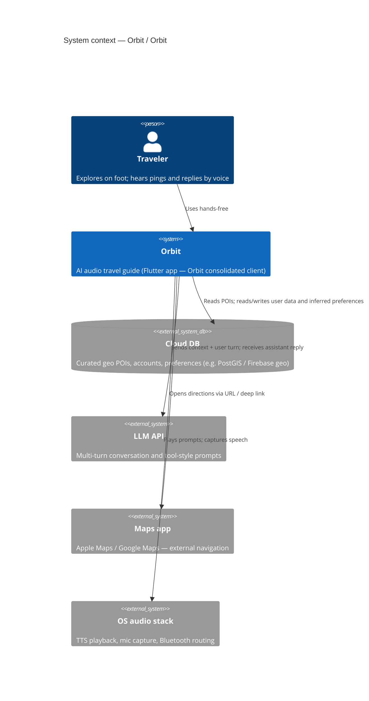
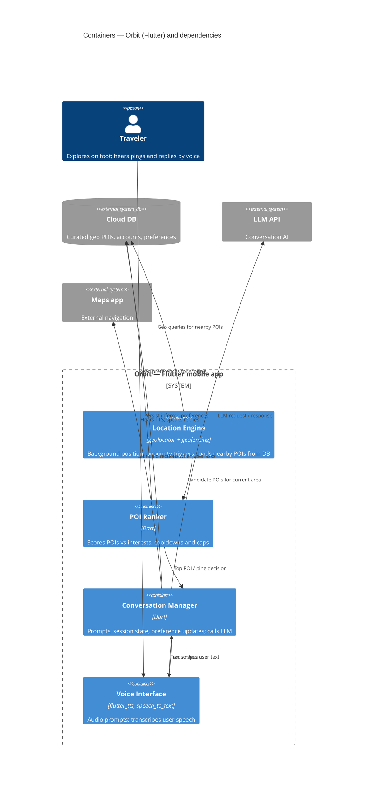

# Orbit — Architecture Document

## What is Orbit?

Orbit is an **audio-first travel experience**: an AI-powered audio travel guide for people exploring cities on foot. Rather than requiring the user to open an app and search, Orbit runs quietly in the background and pings the user through their earbuds when something interesting is nearby — for example, “Hey, there’s a 400-year-old spice market four minutes away, want to check it out?” The user can respond by voice, ask follow-up questions, get directions, or dismiss the suggestion. The full interaction is intended to be hands-free through whatever audio device they’re wearing.

The core experience is a **location-triggered voice conversation loop**:

1. The app detects the user’s position and queries the Cloud DB for nearby curated POIs.
2. The POI Ranker scores candidates against the user’s interests and filters out recently dismissed places.
3. If a strong match is found, the Voice Interface delivers an audio ping.
4. The user responds by voice; the Conversation Manager handles their reply via LLM.
5. The conversation continues until the user navigates, dismisses, or goes silent.
6. Inferred preferences are written back to the Cloud DB to improve future recommendations.

---

## Consolidation plan (Orbit team)

## Direction, Rationale, Starting Point

For our direction, we want to focus on an audio-based experience in a set geographical location. This resulted from distilling user feedback from our distinct prototypes. Our rationale is that people wanted an audio-based experience and to get suggestions and be able to follow up to learn more. 

Our starting point will be starting fresh and bringing in the key features from all of our prototypes.

## Tech stack

### Mobile app — Flutter

The consolidated app is planned in **Flutter**, targeting iOS and Android from a single codebase. Flutter is appropriate here because the experience does not depend on AirPods-only APIs; audio playback, mic capture, geofencing, speech recognition, and TTS are available through mature Flutter packages.

### Audio — flutter_tts + speech_to_text

`flutter_tts` handles text-to-speech and routes through the active audio device (Bluetooth, wired, etc.). `speech_to_text` wraps platform speech recognition for on-device transcription. On iOS, `AVAudioSession` uses `.playAndRecord` with `.allowBluetooth` so audio routes to the headset where supported. Note: when the mic is active, Bluetooth often falls back to HFP/SCO (lower quality than A2DP)—a protocol limitation, not an app bug, and acceptable for voice assistant flows.

### Location — geolocator + geofencing

`geolocator` supports background location; **geofencing** (radius-based triggers) reduces polling and aligns better with background-location policy expectations. The app needs a clear **Always** location justification for store review.

### POI data — Cloud DB

POIs are **curated** in the Cloud DB (not live Google Places), for editorial control over recommendations. The store must support **geospatial queries** (POIs within a radius). Examples: Firebase with a geo package, or Supabase/Postgres with PostGIS.

### Conversation AI — LLM API

The Conversation Manager calls the **LLM API** per conversation turn. POI facts are injected into the system prompt so follow-ups stay grounded (“Is it open?”, “What do they serve?”). Turns are latency-sensitive; a fast Sonnet-class model is the default choice.

### User accounts + preferences — Cloud DB

Accounts, onboarding preferences, and inferred preferences live in the Cloud DB. The Conversation Manager writes inferred preferences after sessions so ranking improves over time.

### Navigation — URL deep-link

Directions open **Apple Maps** or **Google Maps** via deep link rather than in-app navigation, keeping scope tight.

## Who Owns What:
Buckets:
- setting up database, adding POIs (in bay area), geoFlutterFire (Kieran)
- Onboarding and user interests, personalization (Daniel)
- Speech to text and text to speech (Rosalie)
- location tracking + accessing database (Iker)
- AI integration (what the narration says, follow up answers) (GP)

---

## Key design decisions

**Curated POIs over live POI APIs.** Full control over quality and tone, at the cost of ongoing curation and a geo-indexed schema from day one.

**Ping fatigue prevention.** The POI Ranker should enforce cooldowns, hourly caps, and explicit “quiet” windows so proactive audio stays trustworthy.

---

## Architecture deliberation (trade-offs)

These diagrams reflect explicit trade-offs, not a first-pass box diagram:

- **Scale and secrets:** Client-direct Cloud DB + LLM simplifies the v1 topology but moves abuse risk and key management to the client; a **BFF** is the usual fix before scale.
- **Data freshness:** Curated POIs avoid noisy commercial listings but require a **curation pipeline**; there is no automatic “everything nearby” feed.
- **Latency:** Voice loops need fast turns; ranking and POI fetch must stay **small and local** (radius-limited queries, small candidate sets) so LLM is not blocked on large payloads.
- **Boundaries:** The **Voice Interface** is the only container that touches the OS audio stack; **Location Engine** owns geofence signals; **Conversation Manager** owns LLM prompts and session state—so testing and failure modes stay separable.

---

## C4 diagrams

The **context** diagram answers: *What does our system talk to?*  
The **container** diagram answers: *What are the major runnable/deployable pieces, and how does data flow?*

### Context diagram

**Narrative.** The **traveler** uses **Orbit** (single software system under design) for hands-free audio. Orbit reads and writes **Cloud DB** (POIs, accounts, preferences). It calls **LLM** for natural-language turns. For turn-by-turn directions it hands off to the **Maps app**. Audio playback and capture go through the **OS audio stack** (Bluetooth/wired routing, session category). No separate “backend” box appears in v1: the mobile app is the only Orbit-owned runtime between the user and external services.

### Container diagram

**Narrative.** Everything in the **Orbit — Flutter mobile app** boundary runs on the device. The **Location Engine** subscribes to position and geofence events, loads **nearby POI candidates** from **Cloud DB**, and passes a small list to the **POI Ranker**. The ranker loads **user preferences** from the DB, applies cooldowns and interest scoring, and may hand a **top POI** to the **Conversation Manager**. The manager formats prompts, calls **LLM**, updates **inferred preferences** in the DB, and coordinates **navigation intent** to the maps app. The **Voice Interface** (TTS/STT) is the only container that speaks the **OS audio stack**; it exchanges text with the Conversation Manager. Data flow is **out-and-back**: location → DB → rank → optional ping → speech ↔ LLM ↔ speech, with preference writes closing the loop.

