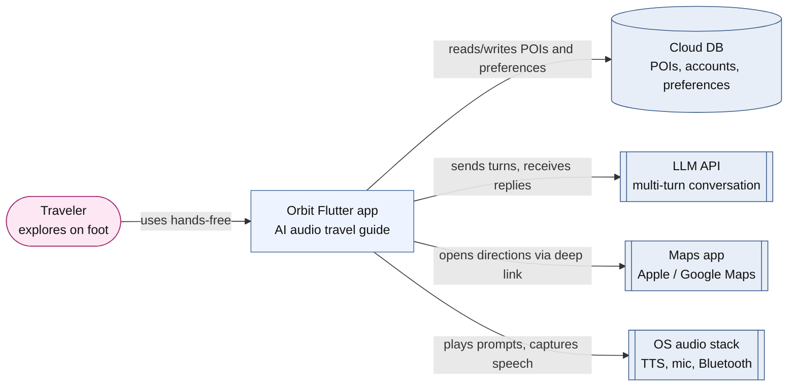
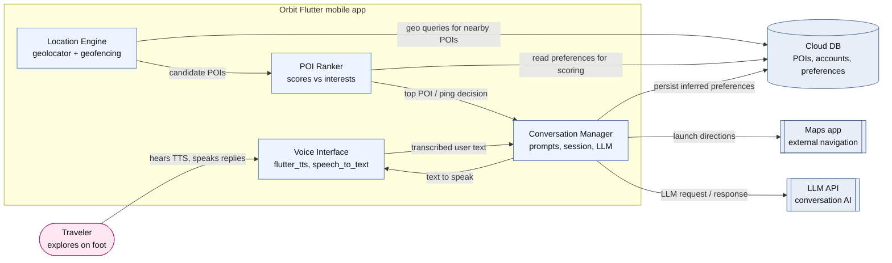
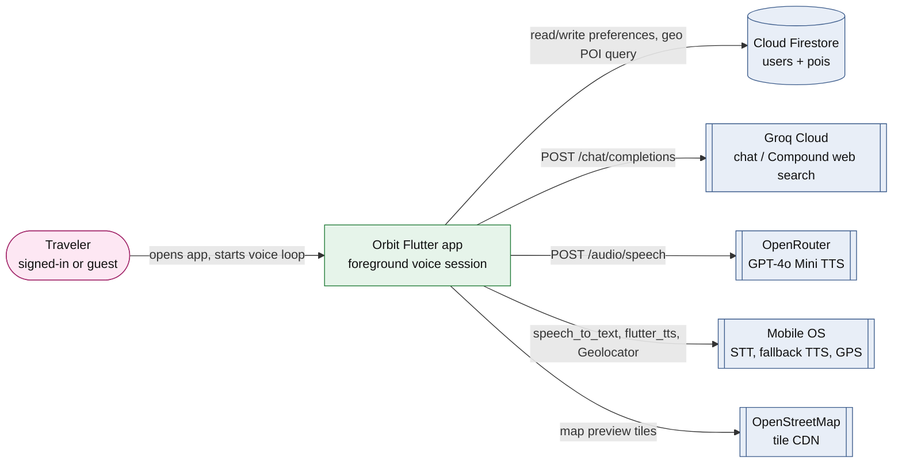
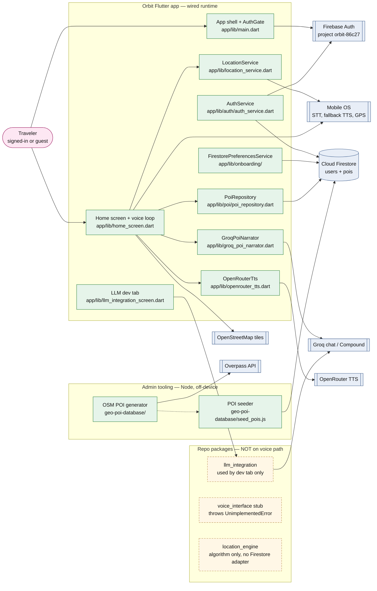

# Architecture retrospective — current state vs. plan

This document compares Orbit's **W4 intended architecture** and **W2 product vision** against what the consolidated Flutter app actually runs at the **end of Sprint 2**. It includes current-state C4 diagrams, three architecture decisions that shifted during implementation, a tech-debt register with Fowler-quadrant tags, and a one-sentence lesson for the next sprint.

---

## W2 product vision revisited

**Original W2 vision (Moore template).** Orbit is an AI-powered interactive travel guide **for** travelers exploring new locations who want meaningful places without constant planning, **who** struggle to find context-rich POIs in real time, **that** surfaces nearby places and delivers a real-time, audio-based tour as users explore, **unlike** static map apps or pre-planned guides, **powered by** location-aware recommendation, NLG, and conversational voice.

**What changed since W2 (Sprint 2 alignment).**

| Element | W2 wording | Current team vision |
|---|---|---|
| Experience mode | Proactive audio as you explore | **Screen-free user experience** — voice and ears first; map is secondary preview, not the primary interaction |
| Personalization | Adapts to location and interests | **Tap-to-select interest onboarding** (chip picker → Firestore) for now; **natural conversational onboarding** is on the vision slide as a later goal |
| Trigger model | Proactively surface relevant places | Still the north star, but the **first shippable loop** is user-initiated: find a place near you → hear AI narration → talk back for more |

The vision sharpened from “smart map companion” toward **hands-free audio guide**. Sprint 2 validated that loop in the foreground before investing in background geofencing and proactive pings.

---

## W4 intended architecture

At Week 4 the team documented a **background, location-triggered voice loop** in `architecture/architecture.md`. The traveler hears unprompted audio pings when a ranked POI matches; a Conversation Manager calls an LLM; a Voice Interface owns STT/TTS; a Location Engine owns geofencing; a POI Ranker enforces cooldowns.

### Intended context diagram (W4)

### Intended container diagram (W4)

Four in-app containers — Location Engine, POI Ranker, Conversation Manager, Voice Interface — with clear boundaries and data flowing location → DB → rank → ping → speech ↔ LLM.

---

## Current-state C4 context diagram

**Narrative.** Today the traveler uses a **foreground** Orbit session: sign in (or continue as guest), complete onboarding, open the voice tab, and start a conversation. Orbit reads **Firestore** for POIs and user preferences, calls **Groq** for LLM narration/follow-ups, calls **OpenRouter** for TTS, and uses the **OS audio stack** for STT and fallback TTS. **Maps app deep links** and **background proactive pings** are not wired yet. Admin tooling seeds POIs offline via Overpass → JSON → Firebase Admin.

---

## Current-state C4 container diagram

Rendered as a mermaid `flowchart` for broad renderer support. Solid green = wired runtime in `app/`; dashed yellow = repo packages not integrated into the voice path; dotted edge = offline admin handoff.

---

## Architecture decisions that shifted

### 1. Background “ping when matched” → foreground “find → narrate → talk back”

| | |
|---|---|
| **Context** | W4 architecture assumed a **background Location Engine** with geofencing: the app watches position, ranks POIs, and proactively pings the traveler through earbuds when a strong match appears. Sprint 1 left geofencing unwired; Sprint 2 needed a demoable end-to-end voice loop. |
| **Decision** | Ship a **foreground session** on the home screen: one-shot GPS → Firestore geohash query → Groq-generated narration → speak/listen follow-ups. Keep the POI database and admin scrape/seed pipeline; defer background triggers. |
| **Consequences** | **Positive:** TestFlight users can experience full voice + POI + conversation today; fewer iOS “Always” location and battery-policy risks in v1. **Negative:** Product copy still mentions background pings; W4 container boundaries (Location Engine, Ranker, Conversation Manager) collapsed into `home_screen.dart`; proactive “companion” feel is not yet real. |
| **Fowler quadrant** | **Deliberate & Reversible** — a scope trade for Sprint 2 velocity; background geofencing remains in the target doc and can be reintroduced without rewriting Firestore or Groq integration. |

### 2. Separate Conversation Manager package → in-app `GroqPoiNarrator`

| | |
|---|---|
| **Context** | W4 placed LLM calls inside a **Conversation Manager** container, backed by the `llm_integration` package with guardrails and rate limiting. Sprint 2 also needed **Compound web search** for grounded follow-ups (“who painted this?”). |
| **Decision** | Implement **`GroqPoiNarrator`** directly in `app/lib/groq_poi_narrator.dart` for the voice path (intro + multi-turn follow-ups), while keeping `llm_integration` on a separate **LLM dev tab** only. |
| **Consequences** | **Positive:** Voice loop shipped with web-search-backed answers quickly. **Negative:** Two Groq HTTP stacks (`GroqPoiNarrator` vs `LlmClient`); guardrails/rate limits on the package path do not protect the live voice path; harder to test conversation logic in isolation. |
| **Fowler quadrant** | **Deliberate & Reversible** — team chose speed over package boundaries; consolidating behind one client is refactor work, not a platform lock-in. |

### 3. Screen-first consolidation → screen-free audio with map as preview

| | |
|---|---|
| **Context** | Early TripSync vision emphasized map pin + taste profile (“pick your next stop in under a minute”). The W8 vision slide reframed Orbit as **screen-free** and named **conversational onboarding** as a future direction; Sprint 2 shipped **tap-to-select interest chips** instead. |
| **Decision** | Prioritize **TTS/STT loop and Groq narration** as the primary UX; add an OSM **map preview** panel as secondary context (user pin only, no POI markers yet). Onboarding saves selected interest tags to Firestore via the chip picker. |
| **Consequences** | **Positive:** Aligns implementation with audio-first differentiation vs Google Maps. **Negative:** Onboarding preferences are saved but **not yet passed** to POI ranking on the home screen (hardcoded interest tags remain); map preview under-delivers vs “discovery” positioning until POI markers and deep links land. |
| **Fowler quadrant** | **Deliberate & Reversible** — product positioning shift that does not require new infrastructure; wiring preferences through is a small, pending code change. |

---

## External services, databases, and AI APIs in use

| Dependency | Kind | Runtime today? | Call site (file → symbol) |
|---|---|---|---|
| Firebase Auth (project `orbit-86c27`) | Identity | Yes | `app/lib/main.dart` → `Firebase.initializeApp`; `app/lib/auth/auth_service.dart` → `AuthService.signInWithGoogle` |
| Cloud Firestore | Document DB | Yes | `auth_service.dart` → `_ensureUserProfile`; `firestore_preferences_service.dart` → load/save preferences; `poi_repository.dart` → geohash POI queries; `geo-poi-database/seed_pois.js` → admin POI seed |
| Groq chat — `groq/compound-mini`, `llama-3.3-70b-versatile` | AI API (LLM + optional web search) | Yes | `app/lib/groq_poi_narrator.dart` → `GroqPoiNarrator.narrate`, `replyToFollowUp`; `LLM-Integration/lib/src/llm_client.dart` → dev tab only |
| OpenRouter TTS (`openai/gpt-4o-mini-tts-2025-12-15`) | AI API (TTS) | Yes | `app/lib/openrouter_tts.dart` → `OpenRouterTts.synthesizeMp3`; key in `orbit_groq_config.dart` |
| Apple / Android speech recognition | On-device STT | Yes | `app/lib/home_screen.dart` → `speech_to_text` |
| Native platform TTS | OS fallback when OpenRouter unavailable | Yes | `app/lib/home_screen.dart` → `flutter_tts` |
| OS GPS (`geolocator`) | Location (when-in-use, one-shot) | Yes | `app/lib/location_service.dart` → `Geolocator.getCurrentPosition` |
| OpenStreetMap tile CDN | Map tiles | Yes | `app/lib/home_screen.dart` → `_MapPreview` / `TileLayer` |
| Google Sign-In | Identity broker | Yes | `app/lib/auth/auth_service.dart` → `GoogleSignIn().signIn()` |
| Overpass API | OSM extract (admin only) | Build-time | `geo-poi-database/generate_pois_from_osm.js` → `fetchPois` |

---

## Tech debt register

Fowler quadrants: **Deliberate / Inadvertent** × **Reversible / Irreversible**.

| Item | Quadrant | Plan |
|---|---|---|
| **Client-side Groq API key** (`GROQ_API_KEY` via `.env` asset / `--dart-define`) | Deliberate & Irreversible (at scale) | Accept for course prototype; before any public scale, add a thin backend-for-frontend proxy and rotate keys. |
| **Monolithic `home_screen.dart`** (~1,170 lines: voice, POI, Groq, map, session UI) | Deliberate & Reversible | Extract Conversation Manager, Voice Interface, and POI selection into separate Dart modules matching W4 containers; keep behavior unchanged via widget tests. |
| **Dual Groq stacks** (`GroqPoiNarrator` vs `LlmClient`) | Deliberate & Reversible | Route voice path through `llm_integration` (or shared HTTP layer) so guardrails, rate limits, and prompts live in one place. |
| **Onboarding preferences not wired to home** — hardcoded `_hardcodedInterestTags` in `home_screen.dart` | Inadvertent & Reversible | Pass `UserPreferences` from `AuthGate` into `OrbitHomeScreen`; use saved tags in `PoiRepository.findBestNearby` and Groq prompts. |
| **Sibling packages unwired** — `voice_interface` stub, `location_engine` without Firestore adapter | Inadvertent & Reversible | Implement `PoiDatabaseApi` adapter for Firestore; wire transcript normalizer; delete duplicate ranking in app once package path is green. |
| **No maps deep links** — no `url_launcher` / Apple or Google Maps URIs | Inadvertent & Reversible | Add “Get directions” intent after user asks; hand off via platform deep link per W4 architecture. |
| **Background geofencing not built** — no location stream, no `ACCESS_BACKGROUND_LOCATION` | Deliberate & Reversible (deferred) | After foreground loop is stable, add geofence plugin + “Always” permission narrative; connect to POI Ranker cooldown rules from W4 doc. |
| **Thin app test coverage** — smoke widget test only; package tests partially RED | Inadvertent & Reversible | Add unit tests for `PoiRepository` ranking and `GroqPoiNarrator` prompt assembly; integration test for speak→listen turn with mocks. |
| **Public Firestore POI reads** (unauthenticated `pois` read in rules) | Deliberate & Reversible | Fine for curated catalog; tighten rules if POI data becomes sensitive or user-specific. |
| **Marketing vs runtime mismatch** — copy promises background pings, app is foreground-only | Inadvertent & Reversible | Update landing/onboarding copy to match shipped behavior until background mode ships. |

---

## Planned dependencies still on the to-wire list

These remain in `architecture/architecture.md` as target design but are **not** part of the live voice path today:

- **POI Ranker as a separate runtime container** with cooldowns, hourly caps, and dismissal memory — ranking logic is inline in `PoiRepository` without fatigue rules.
- **Voice Interface package** — app calls `speech_to_text` directly; `voice-interface` normalizer still throws `UnimplementedError`.
- **Location Engine package** — haversine ranker and abstractions exist; app uses `LocationService` + `PoiRepository` instead.
- **Maps app deep link** — no navigation handoff yet.
- **Inferred preference write-back** — Conversation Manager does not persist learned interests to Firestore after sessions.

---

## What we'd do differently with another sprint

**We would wire saved onboarding preferences into POI ranking and Groq prompts on day one of the sprint instead of shipping with hardcoded interest tags, so the voice loop reflects the interest chips users actually selected during onboarding.**
