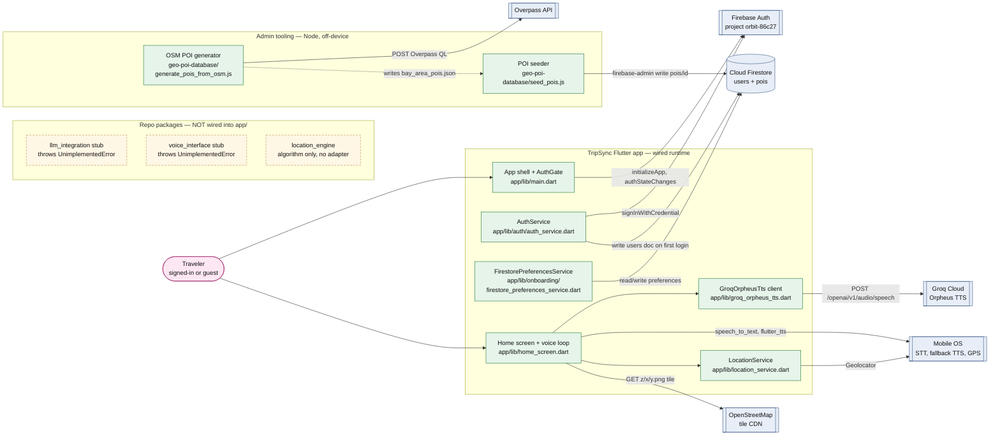

# Architecture retrospective — current state vs. plan

This document is a snapshot of TripSync's architecture **as the code actually stands at the end of Sprint 1**, not the target architecture described in `architecture/architecture.md`. It pairs a C4-style container diagram of what runs today with a per-dependency table that points to the exact file where each external service is called.

## C4 container diagram (current state)

Rendered as a mermaid `flowchart` so it works in every mermaid renderer; the boundaries, shapes, and colors carry the C4 semantics:

- stadium = person
- subroutine box `[[…]]` = external system
- cylinder = external database
- solid green = code that runs in the consolidated app today
- dashed yellow = repo packages that exist but are **not** wired into `app/`
- solid blue = external dependency
- dotted edge = offline file handoff (not network)

## External services, databases, and AI APIs in use

| Dependency | Kind | Runtime today? | Call site (file → symbol) |
|---|---|---|---|
| Firebase Auth (project `orbit-86c27`) | Identity / AuthN | Yes | `app/lib/main.dart` → `Firebase.initializeApp`, `FirebaseAuth.instance.authStateChanges()`; `app/lib/auth/auth_service.dart` → `AuthService.signInWithGoogle` |
| Cloud Firestore (same project) | NoSQL document DB | Yes | `app/lib/auth/auth_service.dart` → `_ensureUserProfile` (writes `users/{uid}`); `app/lib/onboarding/firestore_preferences_service.dart` → `FirestorePreferencesService.load` / `save` (`users/{uid}.preferences`); access rules in `firestore.rules`; admin-side bulk write in `geo-poi-database/seed_pois.js` (`pois/{id}`) |
| Groq Cloud — Orpheus English TTS (`canopylabs/orpheus-v1-english`) | AI API (text-to-speech) | Yes | `app/lib/groq_orpheus_tts.dart` → `GroqOrpheusTts.synthesizeEnglishWav` (POST `https://api.groq.com/openai/v1/audio/speech`); API key read in `app/lib/tripsync_groq_config.dart`; invoked from `app/lib/home_screen.dart` → `_runSpeakThenListen` |
| Apple `SFSpeechRecognizer` / Android `SpeechRecognizer` | On-device STT (OS AI) | Yes | `app/lib/home_screen.dart` → `_speech.initialize`, `_speech.listen` via the `speech_to_text` plugin |
| Native platform TTS (`AVSpeechSynthesizer` / Android TTS) | OS speech engine, used as fallback when `GROQ_API_KEY` is empty or Groq fails | Yes | `app/lib/home_screen.dart` → `_tts.speak` via `flutter_tts` |
| OS location services (GPS) | OS sensor | Yes | `app/lib/location_service.dart` → `Geolocator.getCurrentPosition` via `geolocator` |
| OpenStreetMap tile CDN (`tile.openstreetmap.org`) | Map tile service | Yes | `app/lib/home_screen.dart` → `_MapPreview` `TileLayer(urlTemplate: 'https://tile.openstreetmap.org/{z}/{x}/{y}.png', userAgentPackageName: 'edu.scu.orbit')` |
| Google Sign-In SDK (`accounts.google.com`) | Identity broker feeding Firebase Auth | Yes | `app/lib/auth/auth_service.dart` → `GoogleSignIn().signIn()` |
| Overpass API (`https://overpass-api.de/api/interpreter`) | OSM data extract — **admin-only**, never called from the mobile app | No (build-time only) | `geo-poi-database/generate_pois_from_osm.js` → `fetchPois` |

## Planned dependencies that are not yet wired

These appear in `architecture/architecture.md` as part of the target design but have **no live call site** in the consolidated `app/` runtime yet.

- **LLM API for the Conversation Manager.** Skeleton lives in `LLM-Integration/lib/src/llm_client.dart` (`LlmClient.completeText` throws `UnimplementedError`) and `LLM-Integration/lib/src/llm_config.dart` (`LlmConfig.fromEnvironment` throws `UnimplementedError`). The package is not listed in `app/pubspec.yaml`, so the home screen still shows a hard-coded `_placeRecommendation` string in `app/lib/home_screen.dart`.
- **Voice Interface package.** `voice-interface/lib/src/transcript_normalizer.dart` is a stub; the app uses `speech_to_text` directly in `home_screen.dart` instead.
- **Location Engine package.** `location-engine/lib/src/location_engine.dart` defines `UserLocationApi` and `PoiDatabaseApi` abstractions plus a haversine ranker, but no concrete adapter (e.g. a Firestore `PoiDatabaseApi`) is wired into `app/`.
- **Maps app deep link (Apple Maps / Google Maps).** No call site — no `url_launcher`, no `maps://`, `comgooglemaps://`, or `geo:` URIs anywhere under `app/`.
- **POI Ranker as a runtime container.** Not present in `app/`; the closest code is the algorithm inside the un-wired `location_engine` package.

## One-sentence summary

The current runtime is a single Flutter client that talks to **Firebase Auth + Firestore** for identity and per-user state, **Groq Orpheus** for cloud TTS (with on-device TTS as fallback), **OS STT and GPS** locally, and **OSM tiles** for the map preview — while the LLM, POI ranker, maps deep-link, and the three sibling Dart packages remain on the to-wire list for Sprint 2.
