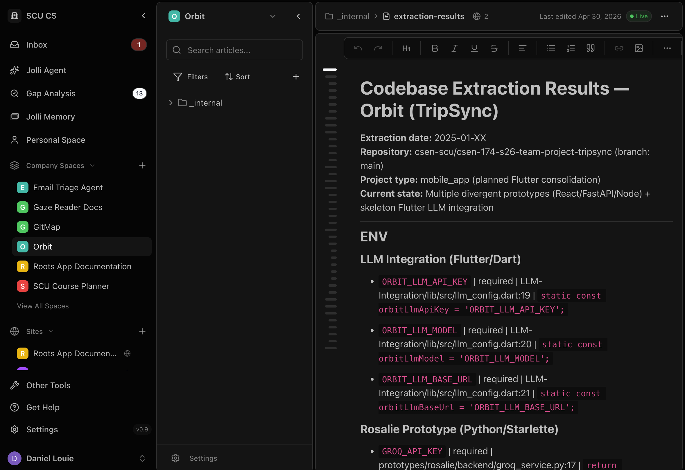

# Sprint 1 — Testing Strategy and TDD (Week 5)

## Overview

This document covers the team's Sprint 1 testing deliverable. We wrote a set of failing spec tests against the public interfaces of each Sprint 1 module (user onboarding, location engine, voice interface, Orbit LLM seam, geo POI database), turned the simplest unit tests green by implementing minimal code, installed the obra/superpowers TDD skill into the repo, used it to generate additional tests beyond the team-written set, critiqued two of those AI-generated tests, and connected the repo to Jolli.ai. Tests live under `tests/` and are runnable with a single `dart test` invocation against the workspace; the JS-only Firestore integration test runs separately with `node --test`.

## Test inventory

| File | Owner | Type | Status at deadline |
| --- | --- | --- | --- |
| [`tests/daniel_preferences_test.dart`](../tests/daniel_preferences_test.dart) | Daniel | Unit (onboarding preferences) | GREEN |
| [`tests/iker_location_database_unit_test.dart`](../tests/iker_location_database_unit_test.dart) | Iker | Unit (location engine + DB seam) | GREEN |
| [`tests/gp_llm_unit_test.dart`](../tests/gp_llm_unit_test.dart) | Gurprasaadhora | AI behavior (Orbit LLM output shape) | RED |
| [`tests/rosalie_voice_transcript_test.dart`](../tests/rosalie_voice_transcript_test.dart) | Rosalie | Unit (transcript normalization) | RED |
| [`tests/geo_poi_database.test.js`](../tests/geo_poi_database.test.js) | Kieran | Integration (Firestore + geohash query) | RED until creds + seed data are wired in CI |
| [`tests/ai_generated_tdd_tests.dart`](../tests/ai_generated_tdd_tests.dart) | AI-generated (Part 3) | Mixed | 3 GREEN, 1 RED |

Each test includes a one-sentence plain-language comment from the user's perspective and follows the Arrange–Action–Assert structure required by the rubric.

## Part 2 — Red to Green narrative

We started with every team member's unit test failing for a meaningful reason: the production code referenced by the test either threw `UnimplementedError` or did not yet exist. Daniel and Iker then implemented the smallest code paths that satisfied the assertions — the JSON round-trip plus in-memory `FakePreferencesService` for Daniel, and the `LocationEngine` consent check + bounded radius query for Iker — without anticipating future behaviors. Two unit tests in Daniel's suite and two in Iker's flipped to GREEN by the deadline; the AI-behavior test (GP), the transcript normalizer test (Rosalie), and the Firestore integration test (Kieran) remain RED on purpose, as Sprint-2 work.

## Part 3 — Testing skill

We installed the **TDD skill from `obra/superpowers`** at [`.claude/skills/tdd/SKILL.md`](../.claude/skills/tdd/SKILL.md) (also mirrored at `.cursor/skills/TDD/SKILL.md` for teammates working in Cursor). The skill encodes a strict red–green–refactor loop with an explicit anti-pattern warning against "horizontal slicing" — writing every test up front, then every implementation. We picked it because our stack is split between Dart (mobile + engine packages) and Node (geo POI integration), and the skill is framework-agnostic: it specifies a workflow and a checklist ("test describes behavior, not implementation"; "test would survive internal refactor"), not a particular runner. The concrete change in workflow when the skill was loaded was that AI-generated tests began asserting against the engine's *public* APIs (`LocationEngine.onLocationUpdate`, `normalizeTranscriptForConversation`) rather than reaching into private fields like `_lastQueryPoint`; before loading the skill, a first attempt at a throttling test had instead probed internal state through the fake. The skill also pushed us to write tests vertically (one test → one implementation) instead of batch-generating a wall of speculative tests that would each need rework later.

## Part 4 — AI critique

We picked two of the AI-generated tests in [`tests/ai_generated_tdd_tests.dart`](../tests/ai_generated_tdd_tests.dart) and evaluated each with the three rubric questions.

### Critique 1 — `LocationEngine consent: returns false and does not prompt when location services are disabled`

**Does the test express what the user needs, or just what the code happens to do?** Mostly the user need — a user with OS-level location services disabled should not see a prompt the OS will refuse to satisfy. But the second assertion, `requestPermissionCallCount == 0`, is checking *how* the engine got to the "false" outcome rather than the user-visible result. Real users cannot observe whether a permission API was called zero or three times.

**Would the test break if you refactored without changing observable behavior?** Yes — that is the smell. If someone refactored `LocationEngine` to use a single `getPermissionState()` API call that internally short-circuits, the spy counter would no longer reflect anything meaningful, and the test would fail despite identical user-facing behavior. The coupling is to the fake's internals, not to the engine's contract.

**What input is missing?** The `LocationPermissionStatus.deniedForever` branch. That path is also supposed to skip the prompt, but for a different reason (user has actively rejected, not OS-level off). The two share the "no prompt" outcome but diverge in cause — a domain-specific case the AI conflated.

### Critique 2 — `LocationEngine query throttling: skips DB query when user has not moved past minMovementForRefreshMeters`

**Does the test express what the user needs, or just what the code happens to do?** User need: a user standing still should not generate cloud-DB load. The assertion that the second call returns an empty list and the DB was hit only once reads as a direct spec of that behavior.

**Would the test break if you refactored without changing observable behavior?** Mostly no. `db.queryCallCount` is observable through the boundary (the fake), and the empty-list assertion is on the public return value. An internal switch from haversine distance to a grid-bucket dedup would not break either assertion as long as the throttling outcome is preserved.

**What input is missing?** Two cases: (1) movement at *exactly* the configured threshold (100m) — the implementation uses `>=`, but the test never exercises the boundary, so a regression to `>` would slip through; (2) the case where, after a no-op throttled update, the user finally moves far enough to warrant a real query — the test only verifies the suppression path, not the resumption path.

### Before / after diff

We applied the Critique 1 finding to the consent test. The original asserted on a spy counter; the improved version stages the fake so that *if* the engine had reached the prompt path, it would have received `granted`. A `false` return value then proves the engine short-circuited before reaching the prompt, without naming the internal mechanism.

```diff
- test('returns false and does not prompt when location services are disabled', () async {
-   final locationApi = _FakeUserLocationApi(
-     serviceEnabled: false,
-     currentPermission: LocationPermissionStatus.denied,
-   );
-   final engine = LocationEngine(
-     locationApi: locationApi,
-     poiDatabase: _FakePoiDatabase(),
-   );
-
-   final hasConsent = await engine.ensureLocationConsent();
-
-   expect(hasConsent, isFalse);
-   expect(locationApi.requestPermissionCallCount, 0,
-       reason: 'Skipping the prompt avoids a dead-end dialog the OS will refuse.');
- });
+ test('returns false even when a hypothetical prompt would have granted, because services are off', () async {
+   // Service disabled; permission would flip to granted IF asked.
+   final locationApi = _FakeUserLocationApi(
+     serviceEnabled: false,
+     currentPermission: LocationPermissionStatus.denied,
+     permissionAfterRequest: LocationPermissionStatus.granted,
+   );
+   final engine = LocationEngine(
+     locationApi: locationApi,
+     poiDatabase: _FakePoiDatabase(),
+   );
+
+   final hasConsent = await engine.ensureLocationConsent();
+
+   // false is the user-observable outcome that proves the engine
+   // short-circuited before reaching the prompt path.
+   expect(hasConsent, isFalse);
+ });
```

The improvement is semantic, not cosmetic. The original could pass even if the engine entered the prompt path and ignored the result, because a `denied` fake stays `denied`. The new version cannot pass unless the engine genuinely bypasses the prompt — staging the fake to return `granted` on request would otherwise flip the outcome to true. We also dropped the `requestPermissionCallCount` field from the fake, which was a test-only spy hooked into implementation.

## Part 5 — Jolli connection

All team members joined Jolli.ai using the invite sent to our SCU emails, and one teammate created the company space and connected this GitHub repo. Screenshot of the connected repo:


