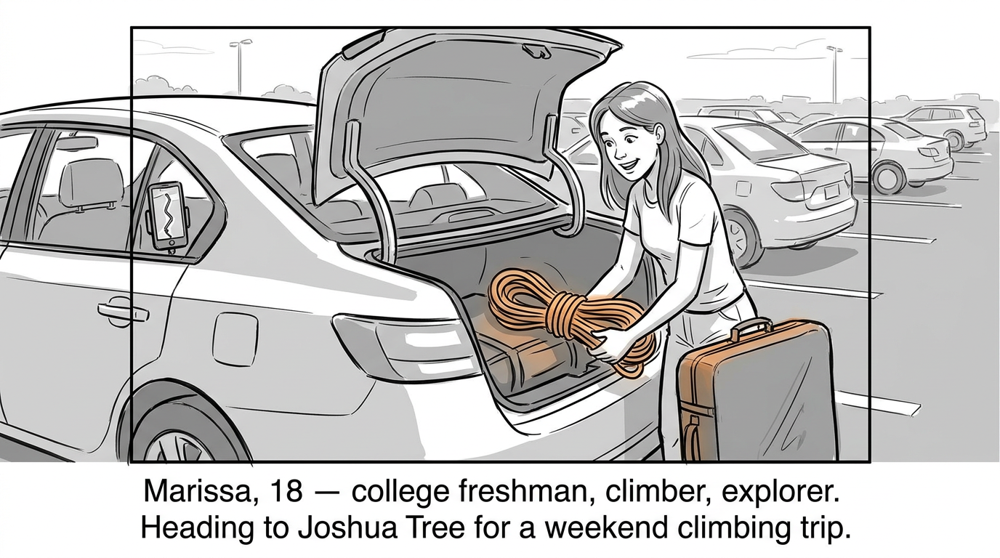
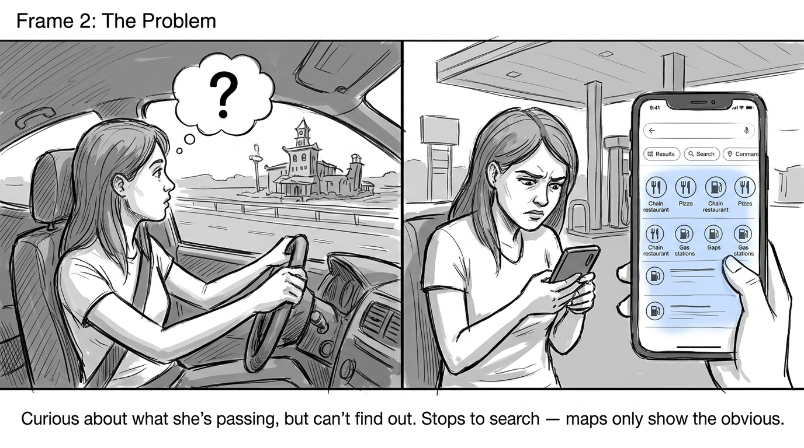
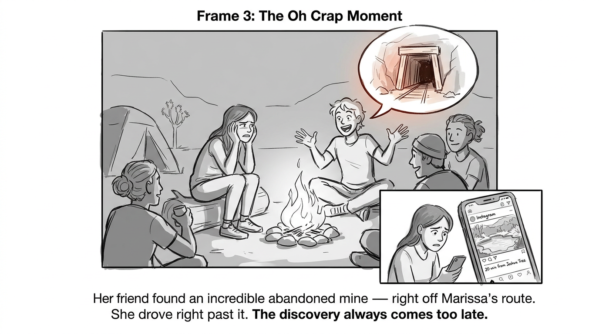
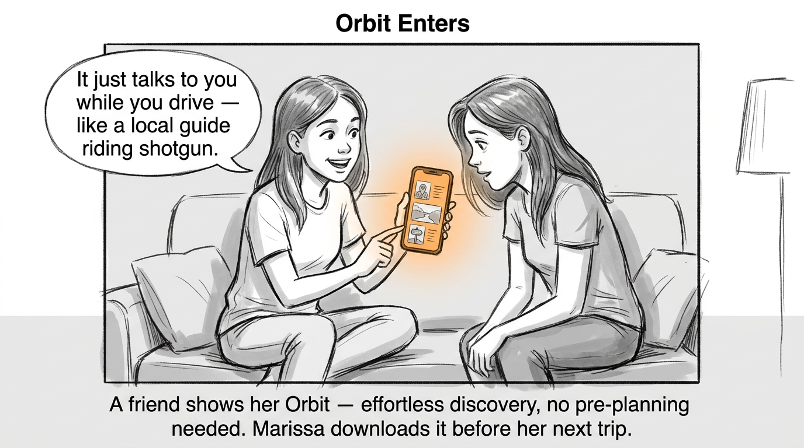
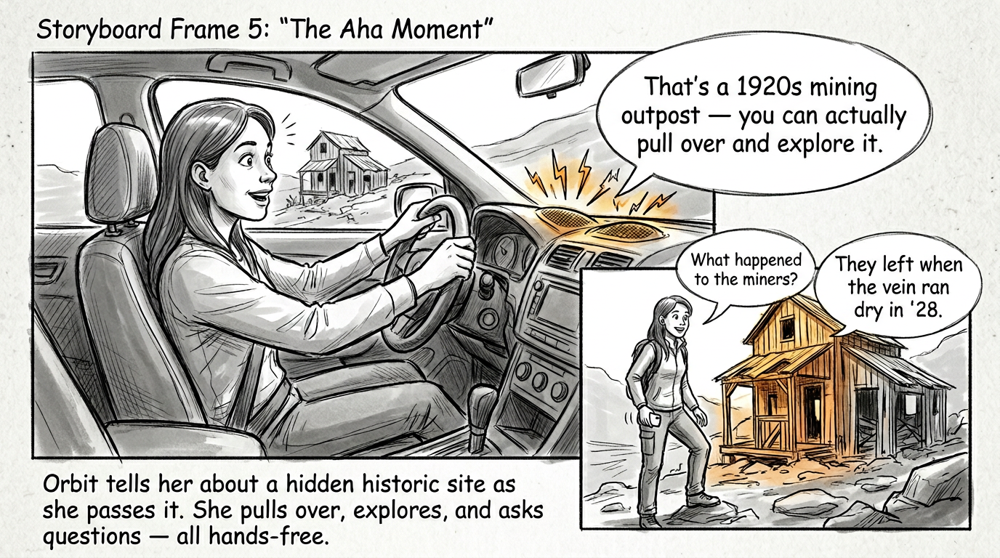
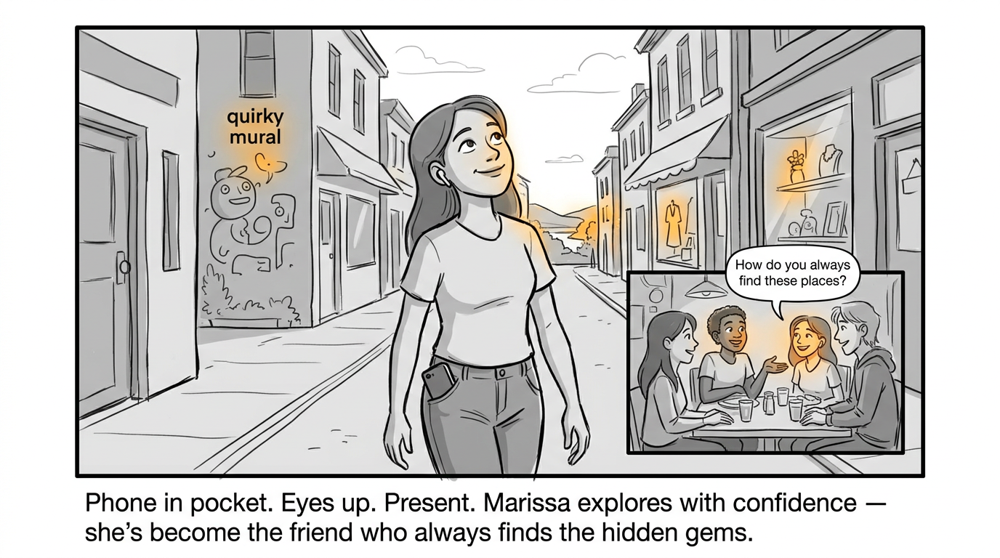

# Orbit Storyboard: Marissa's Journey

## Main Character
**Marissa** — 18, college freshman at Santa Clara University. Outdoorsy, into rock climbing. Comfortable with everyday tech (messaging, maps, phone calls). Plans a main activity but loves filling free time with spontaneous exploration. Wants to be present, not glued to her phone.

---

## Generated 6-Frame Storyline

### Frame 1: Introducing the Main Character

Marissa is packing her car in the SCU parking lot, excited for a weekend climbing trip to Joshua Tree. Climbing gear in the trunk, phone mounted on the dashboard with Google Maps loaded. She's got her route set — 5+ hours of California highway ahead. She loves the adventure of going somewhere new, but her planning stops at "get to Joshua Tree, go climb."

### Frame 2: The Problem Emerges

Two hours into the drive, Marissa passes through small desert towns and sees interesting-looking buildings, odd roadside landmarks, and signs for places she's never heard of. She's curious but can't exactly Google things while driving at 70mph. When she stops for gas in a small town, she opens her phone — Maps shows chain restaurants and gas stations. Yelp shows the same. She scrolls social media for a few minutes, finds nothing useful, and gets back on the road feeling like she's just passing through without really *seeing* anything.

### Frame 3: The "Oh Crap" Moment

Marissa arrives at Joshua Tree and meets up with climbing friends. One of them mentions they stopped at an incredible abandoned mine with a wild history — it was right off the highway Marissa just drove. She had driven right past it. Later, she searches "things to do near Joshua Tree" and ends up at an overcrowded tourist viewpoint that feels generic and rushed. Back at camp, she sees an Instagram post from another climber who found a hidden natural hot spring just 20 minutes from where she's staying. She had no idea it existed. The pattern hits her: **the discovery always comes too late.**

### Frame 4: The Solution Appears

A few weeks later, Marissa's friend shows her Orbit while they're hanging out. Her friend pulls up the app and replays highlights from a recent road trip — fascinating stories about places she drove through, a quirky local restaurant it recommended, a historic site she never would have found. "It just *talks* to you while you drive," her friend says. "Like having a local guide riding shotgun." Marissa is intrigued — it looks effortless, no pre-planning required. She downloads it before her next trip.

### Frame 5: The "Aha" Moment

Marissa is driving to a climbing spot a few weekends later. Orbit is running, connected to her car speakers. As she passes a strange, weathered building off the highway, Orbit chimes in: "Coming up on your right — that's the remains of a 1920s mining outpost. It was one of the last active gold claims in this part of California. You can actually pull over and walk through it." Marissa's eyes go wide. She pulls over, explores the ruins, and asks Orbit follow-up questions out loud — "What happened to the miners? Why was it abandoned?" Orbit answers conversationally, like a knowledgeable friend. Later, near her destination, Orbit suggests a hole-in-the-wall taco shop run by a local family, plus a lesser-known bouldering area that matches her climbing interests. None of these appeared in any of her previous map searches. She didn't touch her phone once.

### Frame 6: Life After Orbit

Marissa now looks forward to the drive itself, not just the destination. She explores unfamiliar towns with confidence, phone in her pocket, listening to Orbit narrate the world around her. She's become the friend who always finds the cool, off-the-beaten-path spots. She spends less time planning before trips and less time scrolling during them. When friends ask "how did you find this place?", she grins. She's more present, more curious, and more connected to the places she visits — not through a screen, but through the experience of being there.

---

## Visual Style
- Medium-quality sketches — clear enough to understand, not so detailed that viewers fixate on irrelevant details
- Minimal color palette — primarily grayscale/monochrome
- Strategic use of color to highlight key elements (the Orbit app interface, important discoveries, emotional moments)
- Text captions describing key interactions and story beats
- Focus on character experiences and what the tool provides, not on UI details

---

## Storyboard Quality Check

| Question | Answer |
|----------|--------|
| **Is the main character relatable?** | Yes — college student on a road trip is universally relatable, especially for the target demographic |
| **Is the problem visceral?** | Yes — the frustration of driving past things, scrolling instead of exploring, and discovering things too late resonates emotionally |
| **Is the "Oh Crap" moment real?** | Yes — finding out you missed something amazing is a common, authentic travel frustration |
| **Is the solution introduction natural?** | Yes — friend recommendation and social media discovery are realistic channels |
| **Is the "Aha" moment believable?** | Yes — learning about a specific place as you pass it, hands-free, is a concrete and exciting experience |
| **Is the "after" state aspirational?** | Yes — being present, confident, and the friend who "always finds cool spots" is genuinely desirable |
