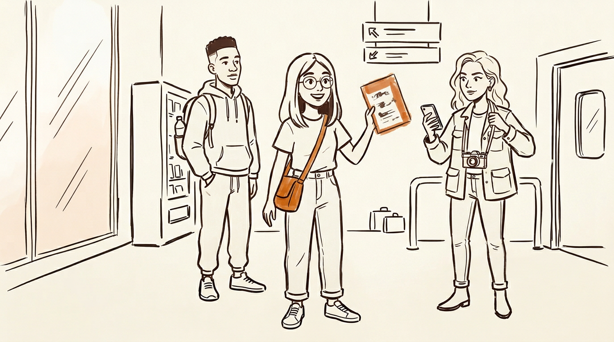
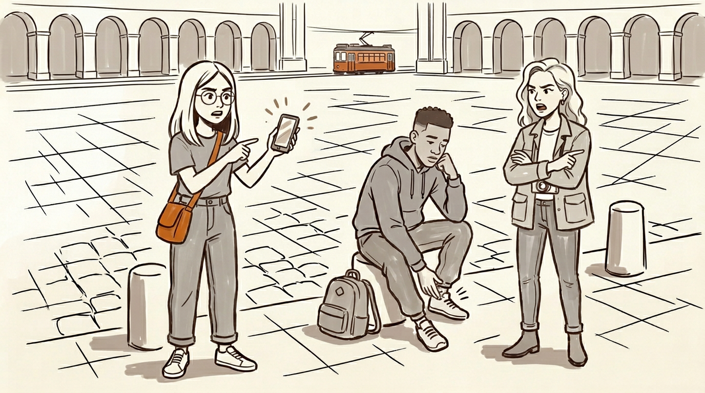
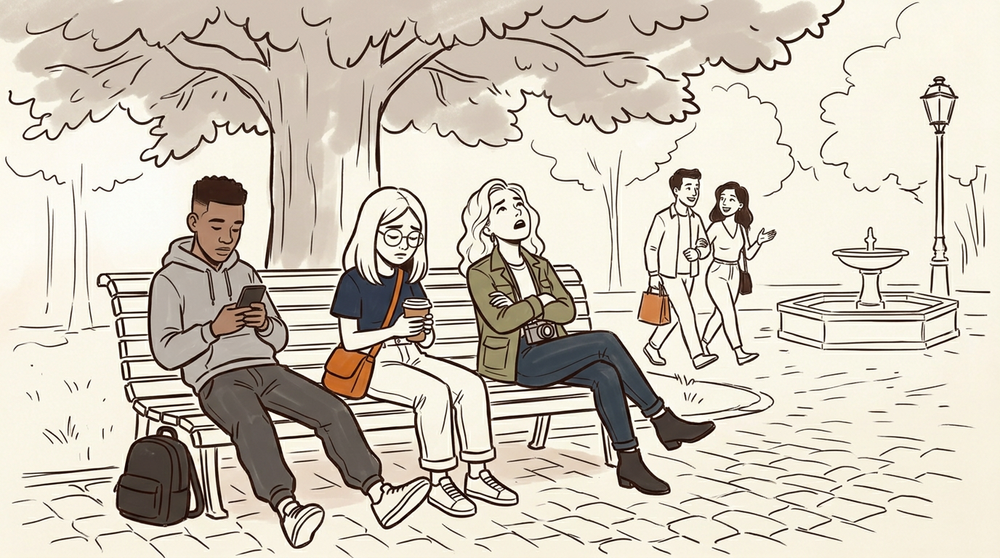
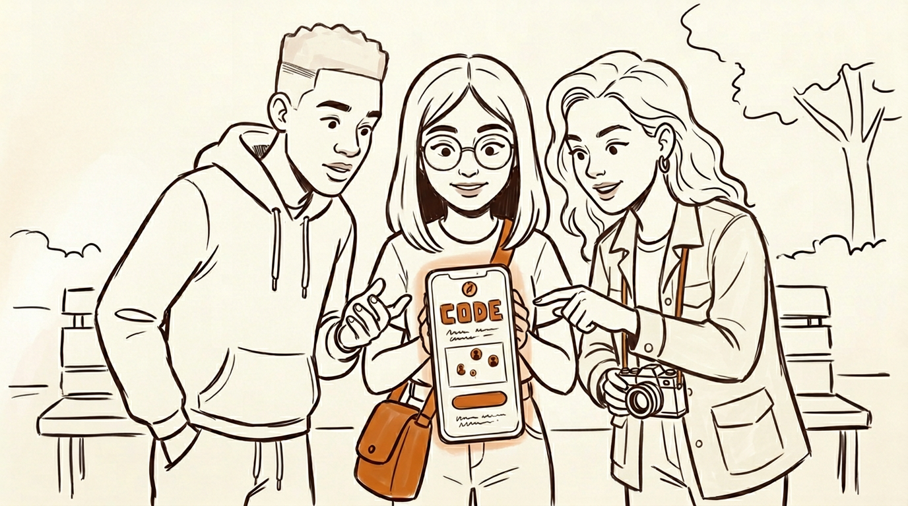
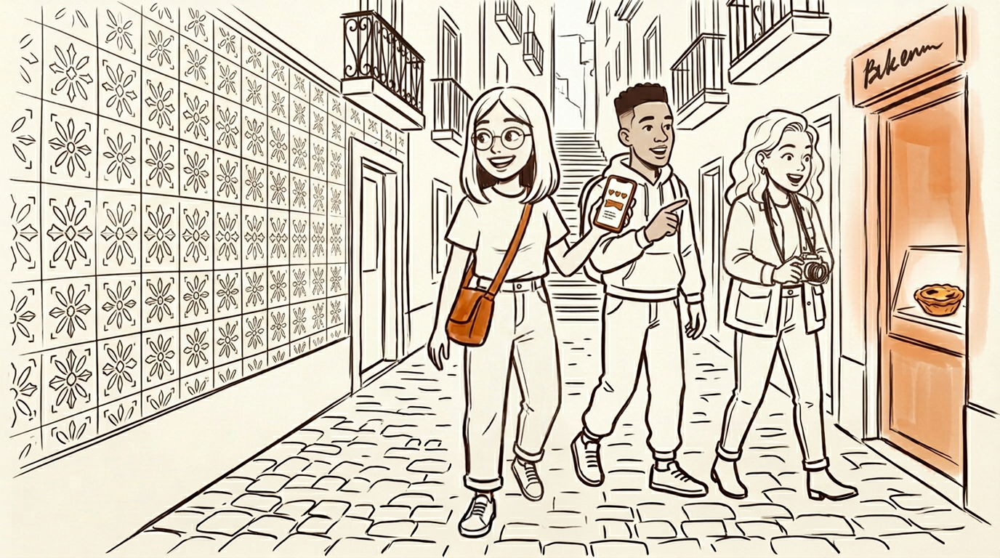
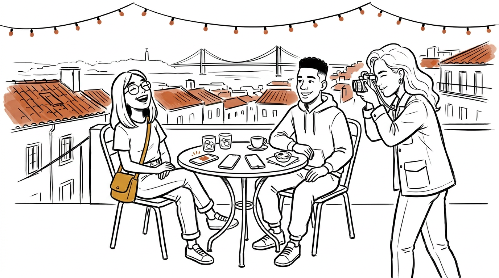

# Orbit Together — Storyboard (Iker)

> Divergent direction: Orbit as a **multi-person** experience. Same product
> vision (AI-powered interactive travel guide, real-time location-aware
> recommendations), but the unit of use is a **small friend group** instead
> of a solo traveler.

---

## Main persona

**Priya Sharma** — 24, first job out of school, first time abroad with friends.
She's the one in the group chat with the color-coded Google Doc, the restaurant
reservations, and the backup weather PDF. She wants everyone to have a good
time; "everyone" is Marcus (her college roommate, perpetually hungry and
allergic to itineraries) and Leah (foodie, picky, vetoes anything that looks
like it has a TripAdvisor sticker on the door). Day one of their long weekend
in Lisbon. Priya's plan is about to collide with reality.

Supporting cast (also on every frame):

- **Marcus, 24** — tired feet, gray hoodie, wants a bench and a sandwich.
- **Leah, 25** — olive utility jacket, camera around her neck, allergic to
  tourist traps.

---

## Frame 1 — Meet the trio

**Airport arrivals, Lisbon.** Priya steps off the jet bridge holding a
printed-out itinerary in a plastic sleeve. Marcus is already eyeing the food
court. Leah is scrolling a Reddit thread titled *"hidden pastéis de nata in
Lisbon."* They hug, they're excited — but their three versions of the trip are
already pulling in different directions. This is the problem Orbit Together
exists to solve, before anything has technically gone wrong yet.

## Frame 2 — The problem emerges

**Praça do Comércio, 3 PM, day one.** They've walked four hours. Priya's doc
says *next stop: Jerónimos Monastery*. Marcus's feet hurt. Leah is done with
monuments. Three phones come out. Priya's on Google Maps. Marcus is on Yelp.
Leah is on a travel blog. Every app gives a different answer, none of them know
any of these neighborhoods, and none of their apps know *them*. Fifteen minutes
pass. Nothing decided. The sun is moving.

## Frame 3 — The "oh crap" moment

**A bench in Jardim do Príncipe Real.** They slump down next to a stone
fountain. Priya's coffee is cold. Marcus is scrolling Instagram — *his* feed
is people who planned better trips. A couple walks by laughing, carrying a
paper bag from a shop none of them saw on any list. Priya realizes the good
parts of traveling with friends are happening to strangers, and it's only been
four hours. If they can't even agree on an afternoon, what about the whole
weekend? The group chat is about to turn into the group fight.

## Frame 4 — The solution appears

**Same bench, one phone out.** Priya opens Orbit Together and shows Marcus and
Leah: one map, one code, everyone joins with their own phone, everyone picks
what they're into today. No more three-apps-three-answers. She taps **Start
session** and reads them a four-letter code. Marcus types it in while
pretending not to be interested. Leah joins last, picks *no tourist traps*,
and adds *foodie, locals only* as her vibe. Three little avatars pop onto one
shared map. They lean in.

## Frame 5 — The "aha" moment

**The payoff.** Orbit pulls five nearby spots. Each card has a single
sentence written *to each of them by name*: for Leah, the pastel de nata
place the locals actually go to — not the TripAdvisor one. For Marcus, a
tiny cervejaria with bench seating and a short queue. For Priya, a 1870s
bookstore two blocks away. The same map shows all five pins. They each tap
a ❤️. *Manteigaria* surfaces as the group pick — all three hearts, nobody
👎. Orbit reads one short spoken line as they stand up: *"Alright Priya,
Marcus, and Leah — Manteigaria, six minutes. Counter seats beat the table,
trust me."* They laugh, for real. They start walking.

## Frame 6 — Life after

**Rooftop bar, end of day one.** Phones face down on the table for the first
time. Priya's doc is closed. Marcus is eating a third pastel de nata. Leah
is taking a picture of *them*, not the view. The Orbit session stays open in
the background, quietly saving today's pins as a shared trip recap they'll
revisit on the flight home. For the rest of the weekend, the question
*"what do we do now?"* takes ten seconds, not forty minutes. The group chat
stops being where arguments happen and goes back to being where memes live.

---

## Visual style note

Low-fidelity UX storyboard sketches. Warm muted palette — soft paper-white
background, warm gray ink for line work, one accent color (terracotta /
burnt orange) reserved for emotional highlights and the Orbit interface.
Characters rendered loose but consistent — same clothes across frames,
minimal facial detail, expressive posture over expression. Lisbon cues
(azulejo tile walls, cobblestones, yellow tram, pastel buildings) appear
in the background as light linework, never the focus.

---

## Storyboard quality check

| Question | Answer |
|---|---|
| **Is the main character relatable?** | Yes. "Friend who makes the Google Doc" is a universal trip persona. |
| **Is the problem visceral?** | Yes. Every reader has been in a group that stalled out on a sidewalk with three phones out. |
| **Is the "oh crap" moment real?** | Yes. The realization that *the trip itself* is at risk, not just an afternoon, is the emotional pivot. |
| **Is the solution introduction natural?** | Yes. One friend already has it, shows the others; low-stakes onboarding. |
| **Is the "aha" moment believable?** | Yes. Personalized per-member "why YOU" lines and live consensus are concrete, demonstrable mechanics — not vibes. |
| **Is the "after" state aspirational?** | Yes. Phones face down, group chat back to memes, trip recap saved. The product's job is to unblock presence. |

---

## How this shapes the prototype

- **Code-based shared session** (4-character code, no accounts) — lowest
  possible friction for the "oh crap" → "solution" transition in Frame 4.
- **Per-member "why YOU" lines** — the mechanical heart of the "aha" moment
  in Frame 5. Each POI card shows N short lines, one per member, with
  the viewer's own line bolded and on top.
- **Reactions + consensus surfacing** — ❤️/🤔/👎 per person, group pick
  surfaces when the majority hearts it. No chat argument.
- **Group-aware narration** — when the destination locks, Groq generates a
  spoken line that addresses the group by name, referencing their individual
  picks. Browser Web Speech API reads it out loud so it works instantly at
  the gallery walk.
- **Demo personas** — a one-tap "Be Priya / Be Marcus / Be Leah" shortcut
  on the create screen, plus a *"Add the other two as demo personas"* button,
  so a lone presenter at a gallery walk can show the multi-user experience
  from a single laptop.
